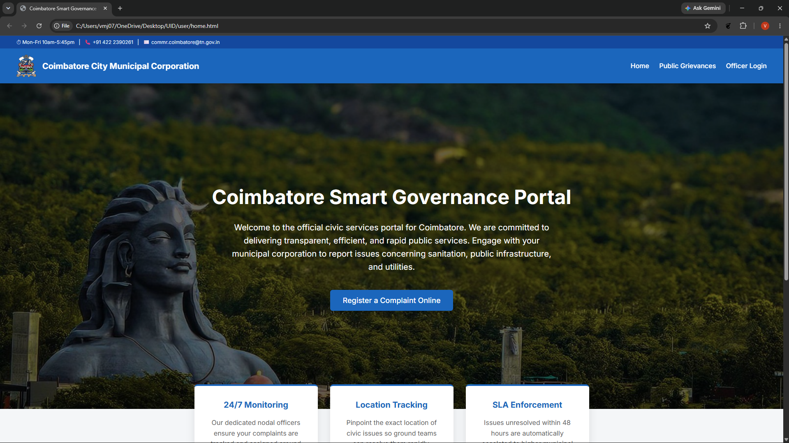
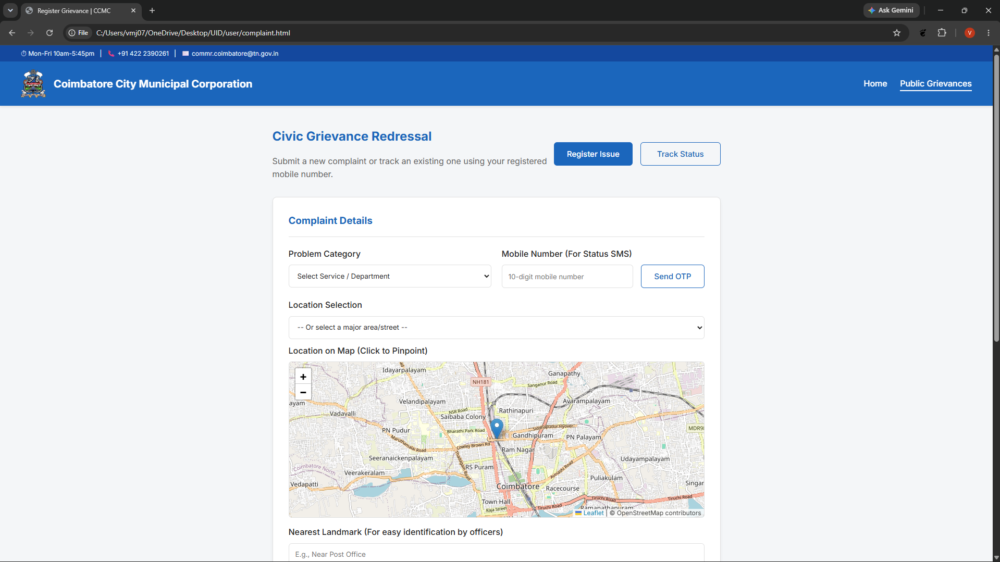
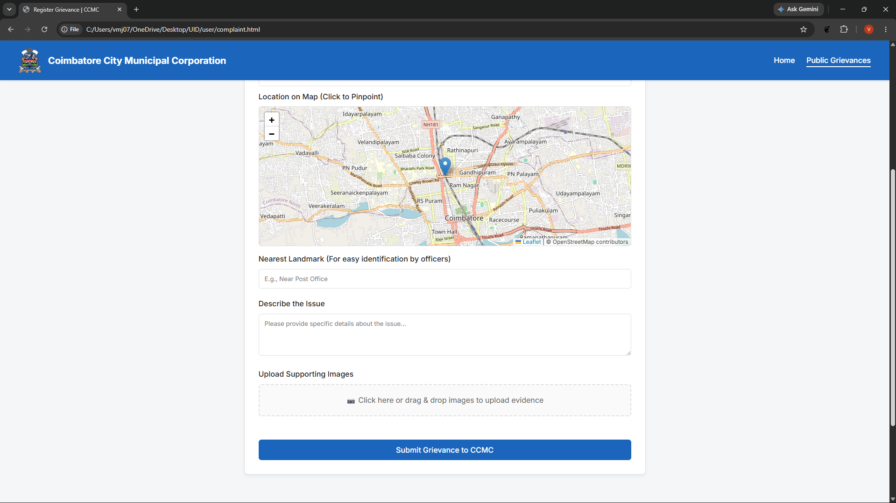
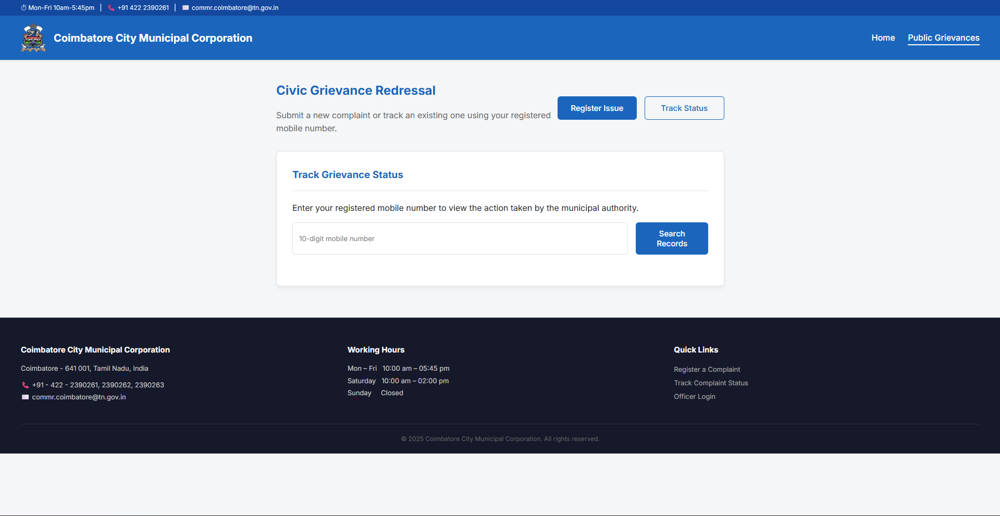
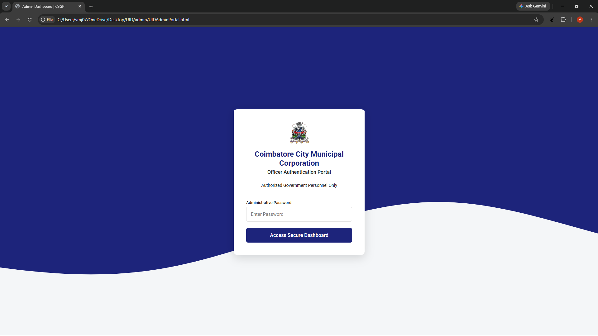
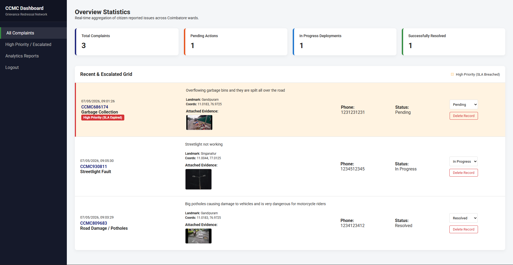
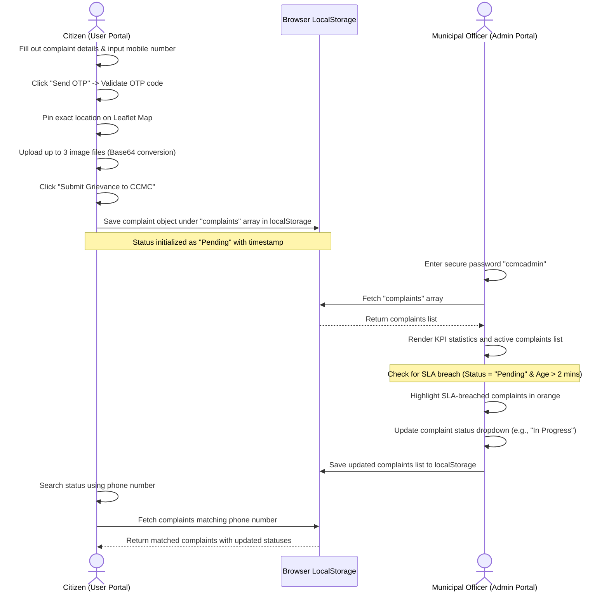

# Coimbatore City Municipal Corporation (CCMC) — Smart Governance & Grievance Redressal Portal

### *A Dual-Interface Citizen-Officer Portal for Public Grievance Registration, Mapping, and SLA-Driven Administration*

---

## 1. Project Overview

The **Coimbatore Smart City Governance & Grievance Redressal Portal** is a client-side web application designed to bridge the gap between citizens and municipal administrators. The system provides a direct pipeline for reporting civic issues—ranging from streetlights and water supply failures to road damage and sanitation problems—and enables city officers to track, escalate, and resolve them efficiently.

Using a modern glassmorphic interface, Leaflet-based geospatial maps, custom styling, and client-side data persistence, the portal simulates a production-grade smart city governance model.


*Figure 1: Coimbatore Smart Governance Portal Landing Page*

---

## 2. Key Features

### 2.1 Citizen Portal (`user/`)
*   **Intuitive Home & Information Portal**: Features a structured, user-friendly home page highlighting CCMC contact channels, civic monitoring hours, and portal capabilities.
*   **Dual-Panel Grievance Redressal**: Transition smoothly between registering new complaints and tracking existing records.
*   **Simulated OTP-Based Verification**: Prevents spam registrations by requiring citizens to enter a valid 10-digit mobile number and verify it via a generated, simulated SMS OTP alert code.
*   **Geospatial Landmark Pinpointing**: Integrated with the **Leaflet JS** API (OpenStreetMap tile layers), allowing citizens to drag-and-drop a map marker or click to pinpoint the exact coordinate of the issue.
*   **Area Selection Helpers**: Quick dropdown selectors instantly center the map on major zones in Coimbatore, including Gandhipuram, R.S. Puram, Town Hall, Peelamedu, Saibaba Colony, Kuniyamuthur, Saravanampatti, Singanallur, Vadavalli, and Podanur.
*   **Multi-Image Evidence Upload**: Allows attaching up to three images as evidence. The form generates live thumbnail previews with a click-to-remove feature, optimizing storage.
*   **Instant Grievance Tracking**: Allows querying the system with a registered mobile number to see all submitted complaints, their details, attached images, and live statuses (Pending, In Progress, Resolved).

### 2.2 Officer Portal (`admin/`)
*   **Secure Officer Authentication**: Restricts access to authorized government personnel with a secure password lock screen (Password: `ccmcadmin`).
*   **KPI Statistics Grid**: Aggregates and displays real-time statistics of total complaints, pending actions, active deployments, and resolved issues. Clicking these cards filters the list grid instantly.
*   **SLA Escalation Monitoring**: Simulates real-time Service Level Agreement (SLA) checking. Any pending complaint that remains unaddressed for more than 2 minutes is highlighted in orange and flagged with a **"High Priority (SLA Expired)"** badge.
*   **Live Status Administration**: Provides officers with dropdown controls to update complaint statuses (e.g., transitioning from `Pending` to `In Progress` or `Resolved`).
*   **Data Purging/Deletion**: Allows removing records from the database once they are audited or resolved.
*   **Interactive Analytics Dashboard**: Renders a dynamic bar chart powered by **Chart.js** that visually maps complaints by landmark and area, helping officers identify problem hotspots and optimize resource allocation.

---

## 3. Deep Dive: "Smart City" Governance Features

This portal is categorized as a "Smart" system due to the integration of automated municipal workflows, responsive telemetry, and localized analytics:

### 3.1 Service Level Agreement (SLA) Escalation Engine
In a production-ready smart city system, complaints must be resolved within strict deadlines depending on their severity. This portal features an **automated SLA Escalation Engine** that monitors complaint ages client-side:
*   **Logic**: Each complaint contains a high-resolution epoch timestamp created on submission (`Date.now()`).
*   **SLA Calculation**: When the admin dashboard renders, it evaluates:
    $$\text{Age (Hours)} = \frac{\text{CurrentTime} - \text{ComplaintTimestamp}}{1000 \times 60 \times 60}$$
*   **Breach Threshold**: To allow live demonstrations without waiting hours, the SLA breach threshold is set to **2 minutes** ($0.033\text{ hours}$).
*   **Escalation Protocol**: If a complaint's status is still `Pending` and its age exceeds 2 minutes, it is automatically:
    1. Assigned a `High Priority (SLA Expired)` badge.
    2. Styled with a warning orange background (`#FFF3E0`) and a thick red left border (`border-left: 4px solid var(--danger)`).
    3. Sorted dynamically to the absolute top of the complaints list, overriding standard chronologically newest-first sorting, ensuring immediate officer attention.

### 3.2 Geospatial Coordinate Mapping (Leaflet.js)
Instead of relying solely on written addresses, which can be vague and lead to dispatch delays, the system enforces **Geospatial Pinpoint Verification**:
*   **Draggable Pinpointing**: An interactive map powered by Leaflet.js renders the Coimbatore area. Citizens can click on the map or drag a custom marker to identify the exact coordinates.
*   **Coordinate Extraction**: The coordinates (`latitude, longitude`) are updated dynamically in real time and bound to a hidden input field, ensuring they are stored inside the complaint object.
*   **Quick-Wards Selector**: A dropdown containing key CCMC wards (e.g., Gandhipuram, R.S. Puram, Peelamedu) uses pre-mapped coordinates to pan and zoom the map instantly to those locations, simplifying navigation for users.

### 3.3 Simulated OTP Security Protocol
To prevent automated spam and ensure that civic departments are dispatched only to authentic issues:
*   **Verification Constraint**: The complaint submit button remains locked until phone verification succeeds.
*   **OTP Generation**: When the citizen requests an OTP, a randomized 4-digit sequence is generated:
    $$\text{OTP} = \lfloor 1000 + \text{Random}() \times 9000 \rfloor$$
*   **Verification Flow**: The generated OTP is shown to the user in a simulated SMS popup. The user must input this exact sequence into the verification field to unlock submission privileges.

### 3.4 Visual Business Intelligence & Analytics Dashboard
Urban planners require data visualization to manage resources. The admin panel includes a real-time analytics module:
*   **Dynamic Aggregation**: Iterates over the `localStorage` database, parsing the landmark/area field of each complaint.
*   **Hotspot Charting**: A bar chart powered by Chart.js dynamically ranks and displays the top 10 most common complaint areas, allowing officers to identify structural issues (such as recurring drainage blockages in Gandhipuram or streetlight failures in Peelamedu) and deploy preventative maintenance.

---

## 4. Workflow & Visual Demonstrations

### 4.1 Registering a Civic Grievance
1. **Details and Authentication**: The citizen selects the problem category (e.g., Road Damage / Potholes, Water Supply / Leakage, Drainage Overlap) and inputs their mobile number. They click **Send OTP** to receive their verification code.


*Figure 2: Form layout and OTP validation dialog.*

2. **Locational Mapping and Evidence**: The citizen selects a landmark, enters the description, pins the exact location on the Leaflet map, and drags-and-drops up to three supporting photos.


*Figure 3: Interactive Leaflet map pinning and image evidence upload.*

### 4.2 Tracking Status
Citizens search using their registered mobile number to monitor the progress of their complaints. The interface lists the unique Complaint ID (e.g., `CCMC123456`), status badges, and timestamp details.


*Figure 4: Citizen tracking panel showing active and pending grievances.*

### 4.3 Officer Login and Administration
1. **Officer Authentication**: Access the secure administrative dashboard by entering the password `ccmcadmin`.


*Figure 5: Secure Officer authentication lock screen.*

2. **Dashboard Management**: The main dashboard displays statistics cards, filters, status modification tools, and a dynamic Chart.js bar graph of complaints grouped by landmark.


*Figure 6: Admin Dashboard containing real-time statistics, SLA-breached complaints (highlighted), and analytical reports.*

---

## 5. Technical Architecture & Data Flow

The portals utilize client-side state synchronization to share data seamlessly without a heavy database backend. The diagram below illustrates this architecture:



### 5.1 Technology Stack & Dependencies

| Layer | Component / Library | Purpose |
| :--- | :--- | :--- |
| **Structure & Styling** | HTML5 & CSS3 Variables | Defines semantic grids, custom variables, responsive elements, and glassmorphic aesthetics. |
| **Icons & Typography** | Inter & Roboto (Google Fonts) | Establishes modern, clean typography across both portal views. |
| **Interactive Maps** | Leaflet.js (v1.9.4) & OpenStreetMap API | Powers coordinate picking, draggable marker pinning, and zone targeting. |
| **Data Visualization** | Chart.js (via CDN) | Generates dynamic administrative bar charts. |
| **State Persistence** | HTML5 LocalStorage API | Dynamically synchronizes state between the citizen and officer portals in real time. |

---

## 6. Project Directory Structure

The project workspace is structured as follows:

```
├── admin/
│   ├── UIDAdminPortal.html      # Secure administrative dashboard (HTML layout)
│   ├── admin.css                # Stylesheet for sidebar layout, statistics grid, and indicators
│   ├── admin.js                 # Authentication logic, KPI calculations, and Chart.js rendering
│   └── logo.png                 # CCMC logo asset for officer view
├── user/
│   ├── home.html                # CCMC landing page with quick links and hero section
│   ├── complaint.html           # Public grievance registration & tracking view
│   ├── user.css                 # Clean user-portal typography, forms, maps, and status badges
│   ├── script.js                # Core JS logic for Leaflet map, simulated OTP, and form submission
│   ├── cbe.jpg                  # Coimbatore hero section background image
│   └── logo.png                 # CCMC logo asset for citizen view
├── pictures/
│   ├── mainpage.png             # Landing page screenshot
│   ├── complaintregistration1.png # Complaint selection screen
│   ├── complaintregistration2.png # Map mapping & upload screen
│   ├── trackstatusofcomplaint.png # Grievance status tracking screenshot
│   ├── officerlogin.png         # Officer authentication screenshot
│   └── officerwebpage.png       # Administrative dashboard screenshot
└── README.md                    # Project documentation (This file)
```

---

## 7. How to Run & Use the System

Since this is a client-side web application powered by HTML5, CSS3, and JavaScript, it requires **no web server or database installation**.

### 7.1 Steps to Start
1. **Citizen Portal**:
   * Double-click [home.html](file:///c:/Users/vmj07/OneDrive/Desktop/UID/user/home.html) to open the municipal homepage in any modern web browser.
   * Click **Register a Complaint Online** to open the registration form.
2. **Submit a Complaint**:
   * Select a category, enter a valid 10-digit number, click **Send OTP**, and verify the code shown in the dialog.
   * Locate the issue by dragging the map marker or selecting a major Coimbatore area from the dropdown menu.
   * Upload image evidence and add a landmark description. Click **Submit**.
3. **Officer Portal**:
   * Navigate to the **Officer Login** link in the navigation menu, or open [UIDAdminPortal.html](file:///c:/Users/vmj07/OneDrive/Desktop/UID/admin/UIDAdminPortal.html) directly.
   * Authenticate using the password:
     ```text
     ccmcadmin
     ```
   * Manage complaints, update statuses, view priority tasks, and inspect the **Analytics Report** tab to see real-time trends.
4. **Data Sync**:
   * Both portals read and write to the browser's shared `localStorage`. Any actions submitted on the user page will immediately reflect on the admin page upon refreshing or navigating back.

> [!NOTE]
> To test the **SLA Escalation (High Priority)** feature quickly, submit a complaint and wait for **2 minutes** without resolving it. The dashboard will automatically apply an orange highlight and assign it a "High Priority (SLA Expired)" alert badge.

---

*Developed for the Coimbatore City Municipal Corporation Grievance Redressal Program.*

## 8. Academic Citation & Reference
If you build upon this system, adapt the codebase, or reference this smart grievance redressal mechanism in an academic publication or project report, please cite this project as follows:

```bibtex
@misc{ccmc_smart_city_governance_2026,
  author       = {Mrityunjay.V, Vishal.B, Pavithran.P, Sanjit.K.R},
  title        = {Coimbatore City Municipal Corporation (CCMC) Smart Governance and SLA-Driven Grievance Redressal Portal},
  year         = {2026},
  howpublished = {\url{https://github.com/floppa-png/Smart-City-Grievance-Redressal-Portal}},
  note         = {GitHub Repository}
}
```